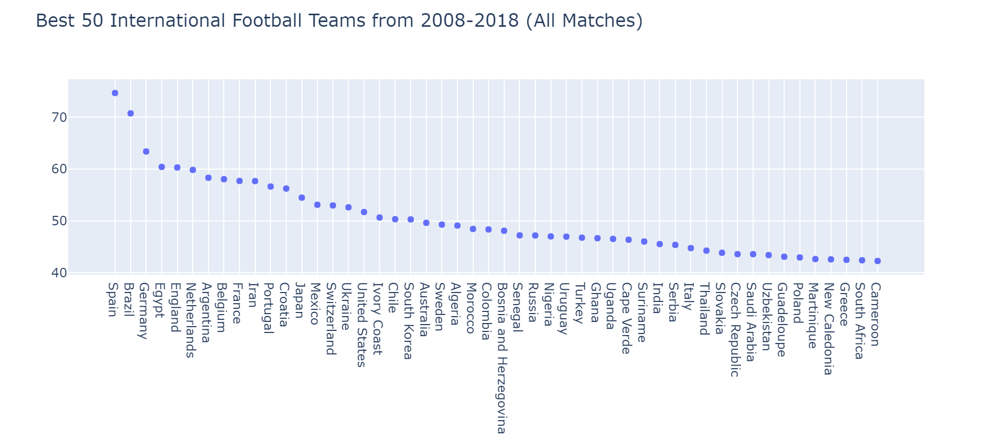

# Football_Analytics
Personal project created to analyze international football results and explore the results to interpret results across the game.
Dataset was obtained from Kaggle and the code for observing the analysis was by Pietro Pozzati. I want to analyze different results
and see which team is the best but also recognize different trends from different eras/decades. 
## Current Status: Ongoing
## Results from Football Analytics Notebook
Determined by the total winning percentage of each team. Includes teams that have played <50 games. Will look at teams that have played more.

## Built With
* Python
* Numpy
* Pandas
* Plotly

## Acknowledgments

* Kaggle
